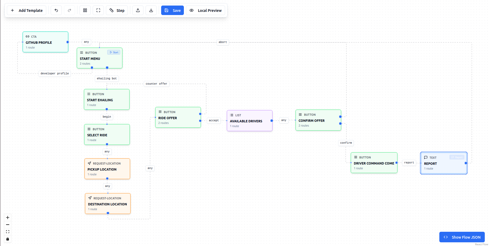
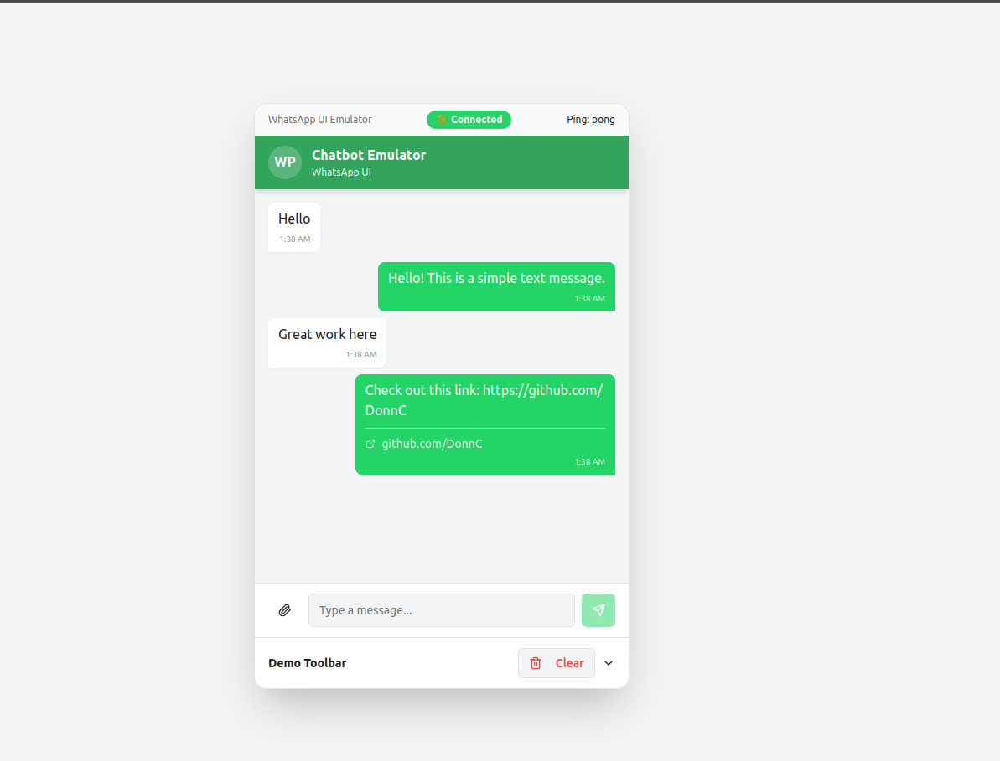

# Frappe Pywce
A complete, enterprise-grade WhatsApp chatbot platform for Frappe, powered by the [Pywce](https://github.com/DonnC/pywce) core engine.

This app transforms your Frappe/ERPNext instance into a powerful, visual, and high-performance conversational app builder.





-----

## Why `frappe-pywce`?

Building data-driven WhatsApp bots is hard. They need to be:

  * **Fast:** Respond instantly to high-traffic webhooks.
  * **Reliable:** Process messages in the correct order (FIFO) for each user.
  * **Stateful:** Handle complex, multi-user, authenticated sessions.
  * **Easy to build:** Allow non-technical users to build and edit flows.

`frappe-pywce` is architected from the ground up to solve all these problems, providing a robust "Conversational App Platform" that lives inside your ERP.

## Core Features

  * **🎨 Visual Flow Builder (`pywce-studio`):** A beautiful, node-based, drag-and-drop canvas (built on ReactFlow) to design complex conversational logic.
  * **📱 High-Fidelity Emulator (`pywce-preview`):** The killer feature. A local, high-fidelity WhatsApp simulator. It runs your *entire* engine, generates *real* payloads, and fires your *real* webhook logic, all 100% on your local machine. **No phone, no public server, no "code-deploy-test" loop.**
  * **⚡ High-Performance Backend:** Built for scale. Webhooks are handled asynchronously using `frappe.enqueue`. Your API responds instantly while background workers do the heavy lifting.
  * **🔒 Guaranteed FIFO & Concurrency:** Handles 500+ concurrent users. A robust Redis locking system ensures that while *different* users are processed in parallel, messages from a *single* user are processed serially (FIFO), preventing broken conversations.
  * **🔑 Secure Auth & Session Management:** Instantly and securely resumes a full Frappe user session from a WhatsApp request, whether through an in-chat WA Flow login or a secure link.
  * **🔗 Live ERP Data:** Securely pull live data *as* the authenticated user. A message like `"Hi {{ doc.first_name }}, your order {{ doc.name }} is now {{ doc.status }_"` just works using a powerful hook template mechanis,.


## Getting Started

### 1. Installation

Install the app to your bench:

```bash
$ bench get-app frappe_pywce https://github.com/DonnC/frappe_pywce.git

$ bench --site <your-site-name> install-app frappe_pywce
```

### 2. Configuration

After installing, go to your Frappe Desk:

1.  Search for **`ChatBot Config`** in the AwesomeBar.
2.  Enter your WhatsApp Business API `Access Token`, `Phone ID`, and `Webhook Token`.
3.  Configure your desired settings

> Although you target to use Local emulator, you may put dummy required WhatsApp Settings.

### 3. Usage

1.  Go to (or on the config doctype) the **`ChatBot Config`** DocType.
2.  Click the **"Open Builder"** button to be taken to the `pywce-studio` visual editor for this flow.
3. To test locally, set the environment to `local`. A button will appear to launch the emulator.

> To launch emulator, ensure you followed the `Development Setup` below

-----

## Development Setup

For contributing or running the UI locally with hot-reloading:

1.  **Start the Frappe Backend:**
    In your bench directory, run:

    ```bash
    $ bench start
    ```

2.  **Start the UI Dev Server:**
    In a *second* terminal, navigate to the app folder and start the Vite dev server:

    ```bash
    $ cd apps/frappe_pywce
    $ yarn dev
    ```

This will launch the Vite server (usually on `localhost:8080`) which hot-reloads as you make changes and proxies all backend requests to your Frappe server.

  * Builder UI: `http://localhost:8080/bot/studio`
  * Emulator UI: `http://localhost:8081/bot/emulator`

3.  **Quick start**
    You can quickly setup a bot by importing an eHailing chatbot and test it locally or build from there

    Check the [example folder here](example)

### Production Build

To build the UI assets for production, run this single command:

```bash
$ bench build --app frappe_pywce
```

This will bundle the React UIs, and they will be accessible at `http://your-frappe-site.com/bot/studio`.

-----

## Support
Need a ChatBot for your business or next project! or just to say Hello - Let's get in touch via [email](donychinhuru@gmail.com)

## Documentation

Visit the [official wce documentation](https://docs.page/donnc/wce/frappe) for a detailed guide.

## Contributing

We welcome contributions! Please check out the [Contributing Guide](CONTRIBUTING.md) for details.

The UIs where largely vibe-coded using Lovable (React)

## License

This project is licensed under the MIT License. See the [LICENSE](license.txt) file for details.

